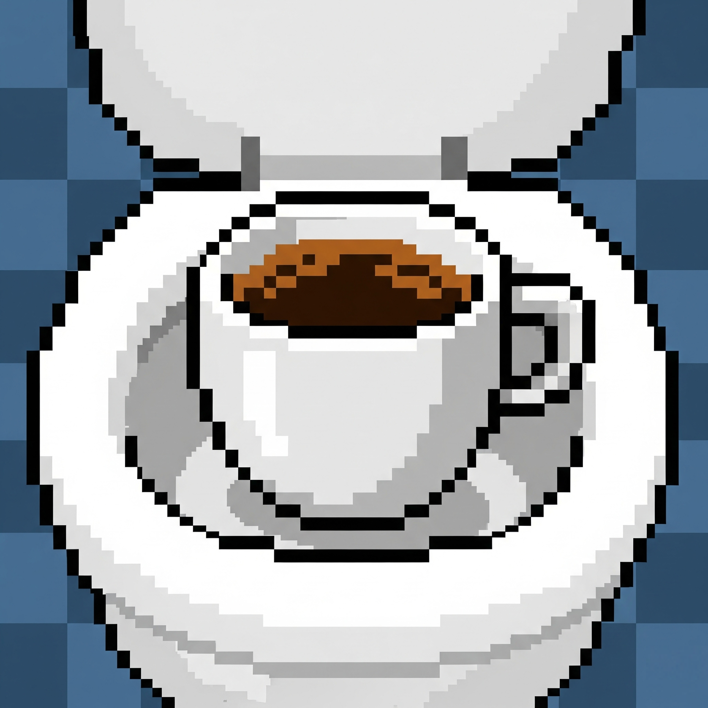

    <h1>Tutta colpa del caffè</h1>
    

# Trama del gioco
Tratto (quasi) da una storia vera.
È una calda 🥵 mattina di luglio. Uno studente di Informatica si sta dirigendo al Dipartimento per sostenere uno degli esami più temuti del corso di laurea: Metodi Avanzati di Programmazione. 

Tutto sembra andare secondo i piani... finché, non appena varcato l'ingresso del campus, viene colto da un’improvvisa, impellente esigenza fisiologica 😰.

Inizia così un'odissea tragicomica tra i corridoi dell’università. Nessun bagno sembra essere facilmente accessibile, ogni porta è chiusa, ogni indicazione fuorviante. Lo studente dovrà esplorare a fondo il campus, raccogliere indizi, affrontare dialoghi surreali e cercare aiuto da personaggi secondari come studenti fuori corso, baristi svogliati, inservienti criptici e persino macchinette del caffè apparentemente senzienti.

Riuscirà a trovare un bagno funzionante prima che sia troppo tardi? E soprattutto, ce la farà ad arrivare in tempo all’esame senza compromettere il proprio futuro accademico?

Un’avventura testuale tra il grottesco e il quotidiano, dove ogni scelta può fare la differenza. 

Preparati a ridere, riflettere... e correre💨.

# Struttura del progetto

Per accedere alla documentazione relativa al progetto [clicca qui](docs/Report.md).